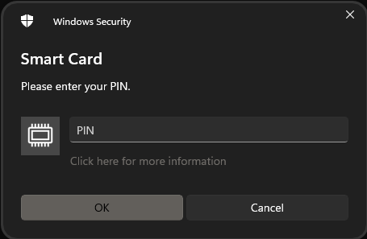

# Using pbyk from the command line

The features provided by `pbyk` will vary with how the utility was built and the platform. Some builds may target different environments. 
Some may provide only a command-line interface, while others provide a graphical user interface (GUI)  and
a command line interface. This chapter addresses usage of the command line interface.

## Usage
As noted above, the available options depend on how the utility was compiled. The example below is from a Windows build
that provides virtual smart card (VSC) support and that targets the development, SIPR and O&M SIPR environments and that
provides a GUI. The supported environments are evident in the description for the `--environment` argument and the availability of the GUI is 
evident by the presence of a `--interactive` argument. The `--interactive` argument can be used to exercise the utility  
from a command line.

Usage instructions as shown by invoking the app with the `--help` argument are below. The remainder of this chapter discusses
use of the tool from a command line. The next chapter discusses using the tool via its GUI.

```text
Usage: pbyk [OPTIONS]

Options:
  -h, --help     Print help (see more with '--help')
  -V, --version  Print version

Arguments:
  -a, --agent-edipi <AGENT_EDIPI>  EDIPI of Purebred Agent who provided the pre_enroll_otp or enroll_otp value
  -s, --serial <SERIAL>            Serial number of YubiKey or virtual smart card (VSC) to provision (available devices can be listed using list_yubikeys or list_vscs); this is not required if only one YubiKey or VSC is present
  -e, --environment <ENVIRONMENT>  Environment to target [possible values: dev, om-sipr, sipr]

Actions:
  -1, --pre-enroll-otp <PRE_ENROLL_OTP>
          Pre-enrollment OTP provided by Purebred Agent identified by agent_edipi
  -2, --enroll-otp <ENROLL_OTP>
          Enrollment OTP provided by Purebred Agent identified by agent_edipi
  -3, --ukm-otp <UKM_OTP>
          OTP generated by user associated with the device on the Purebred portal
  -4, --recover-otp <RECOVER_OTP>
          OTP generated by user associated with the device on the Purebred portal

Diagnostics:
  -p, --portal-status-check  Connect to status interface on portal to affirm network connectivity
  -k, --scep-check           Connect to status interface on CA to affirm network connectivity

Utilities:
  -y, --list-yubikeys  Lists available YubiKey devices, if any
  -v, --list-vscs      Lists available virtual smart card (VSC) devices, if any
  -r, --reset-device   Resets the indicated device to a default state using a management key expected by Purebred applications
  -i, --interactive    Run pbyk as command line app

Logging:
  -l, --logging-config <LOGGING_CONFIG>
          Full path and filename of YAML-formatted configuration file for log4rs logging mechanism. See https://docs.rs/log4rs/latest/log4rs/ for details
  -c, --log-to-console
          Log output to the console
```

Though the usage instructions above include `--interactive`, the commands provided in this chapter were prepared using a
build that did not provide a GUI so no `--interactive` argument is required.

## Purebred Workflow

The Purebred workflow consists of four steps: [pre-enroll](#pre-enroll), [enroll](#enroll), [user key management](#user-key-management)
and [recovery](#recover). When enrolling a YubiKey, these steps are preceded by a device [reset](#reset) operation. The
reset step is necessary to prepare the device for enrollment by clearing previous contents and establishing usage of a 
particular management key. When enrolling a VSC, these steps are typically preceded by VSC creation (and deletion, as necessary). 
See [chapter 4](4_miscellaneous.md#managing-virtual-smart-cards-with-tpmvscmgr) for details on creating and deleting VSCs.

The following sections demonstrate enrolling a YubiKey device with the serial number 15995762 and a VSC with the name 
"Microsoft Virtual Smart Card 0" with the cooperation of a Purebred Agent whose EDIPI is 5533442211. The steps are the same
for YubiKeys and VSCs, with only the serial number value varying. For YubiKeys, the serial number of the device is used. For
VSCs, the name of the device is used.

### Reset

The first step is to list available YubiKeys and/or VSCs. If you already know your device's serial number or if only one device 
is present, this can be skipped (the serial number argument is only needed when more than one device is available).

```bash
$ pbyk -y
Name: Yubico YubiKey OTP+FIDO+CCID; Serial: 15995762
```

```bash
> pbyk -v
Name: Microsoft Virtual Smart Card 1
Name: Microsoft Virtual Smart Card 0
```

Next, reset the YubiKey so that it uses the expected management key.

```bash
$ pbyk -s 15995762 -r
Starting reset of YubiKey with serial number 15995762. Use Ctrl+C to cancel.
Enter new PIN; PINs must contain 6 to 8 ASCII characters: 
Re-enter new PIN: 
Enter new PIN Unlock Key (PUK); PUKs must be 6 to 8 bytes in length: 
Re-enter new PIN Unlock Key (PUK): 
```

A limited form of reset is provided for VSCs. For a reset comparable to that provided for Yubikeys, use the [tpmvscmgr](https://learn.microsoft.com/en-us/windows-server/administration/windows-commands/tpmvscmgr) utility.
[Section 4](4_miscellaneous.md#managing-virtual-smart-cards-with-tpmvscmgr) provides some instructions for using tpmvscmgr
to create or destroy VSCs. The reset support provided by `pbyk` only temporarily removes certificates associated with a VSC
from the user's CAPI store to enable re-execution of the Purebred workflow. Keys corresponding to those certificates are not deleted from the VSC and may be re-registered
with CAPI by the operating system. No PIN entry is required because the VSC itself is not being reset or recreated.

```bash
>pbyk -s "Microsoft Virtual Smart Card 0" -r
Starting reset of VSC with serial number Microsoft Virtual Smart Card 0. This may take a few seconds.
```

### Pre-enroll

The next two steps, Pre-enroll and Enroll, require Purebred Agent participation. The agent should provide their EDIPI and a 
Pre-enrollment OTP. Pre-enrollment must be completed within three minutes of generating the Pre-enrollment OTP.

```bash
$ pbyk -s 15995762 -a 5533442211 -1 74517780
Enter PIN: 
Pre-enroll completed successfully: 07E7730D014D55AFA800609C962E9FF40B61A5AD70E07AAC95E9F6911C4B48E1
```

When enrolling a VSC, PIN entry is not performed directly using `pbyk`. Instead, a PIN entry dialog is displayed by the 
Windows virtual smart card system.

<div align="center">
    
</div>

Pre-enrollment of a VSC is as shown above, but with the VSC name used as the serial number.

```bash
> pbyk -s "Microsoft Virtual Smart Card 0" -a 5533442211 -1 05041153
Pre-enroll completed successfully: 27E2751C3BD47AC24B6328179E081240FC586738
```

### Enroll

Next, the Purebred Agent will affirm the hash value displayed during pre-enrollment to establish trust in the device and will provide an Enrollment OTP.
As with Pre-enrollment, the Enrollment operation must be completed within three minutes of generating the Enrollment OTP.

```bash
$ pbyk -s 15995762 -a 5533442211 -2 63999319
Enter PIN: 
Enroll completed successfully
```

Enrollment of a VSC is as shown above, but with the VSC name used as the serial number. As with pre-enrollment, the Windows
virtual smart card system will prompt for the VSC PIN.

```bash
> pbyk -s "Microsoft Virtual Smart Card 0" -a 5533442211 -2 30800612 -e dev
Enroll completed successfully
```

### User key management

Provisioning user keys does not require Purebred Agent co-operation but does require a UKM OTP. To generate a UKM OTP, 
browse to the My Devices tab on the Purebred portal and click the `Generate OTP` link for the target device to obtain a 
UKM OTP for your device. Provide the value to `pbyk` as shown below. The UKM process must be completed within three minutes of
generating the OTP value.

```bash
$ pbyk -s 15995762 -3 38979363
Enter PIN: 
UKM completed successfully
```

Provisioning user keys to a VSC is as shown above, but with the VSC name used as the serial number.  As with pre-enrollment
and enrollment, the Windows virtual smart card system will prompt for the VSC PIN. Note, key generation in a virtual smart card
is relatively slow. The UKM step may take several minutes.

```bash
> pbyk -s 15995762 -3 26727573
UKM completed successfully
```
### Recover

The Recover operation is optional and follows the same steps as described for UKM. After obtaining a UKM OTP complete
the Recover operation as shown below. The recovery process must be completed within three minutes of
generating the OTP value.

```bash
$ pbyk -s 15995762 -4 30468894
Enter PIN: 
Recover completed successfully
```

Recovering user keys to a VSC is as shown above, but with the VSC name used as the serial number.  As with pre-enrollment
and enrollment, the Windows virtual smart card system will prompt for the VSC PIN. In some cases, installation of a recovered
key into a VSC will fail, in which case a prompt will be displayed to the user and the key will be installed as a software
credential.

```bash
> pbyk -s 15995762 -4 69550720
Recover completed successfully
```