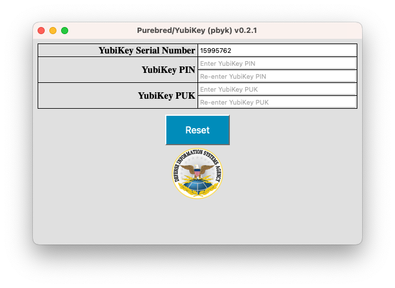

# Using pbyk as a desktop application

The features provided by `pbyk` will vary with how the utility was built. Some builds may target different environments.
Some may provide only a command-line interface, while others provide a graphical user interface (GUI) and
a command line interface. This chapter addresses usage via the GUI.

## Purebred Workflow

The Purebred workflow consists of four steps: [pre-enroll](#pre-enroll), [enroll](#enroll), [user key management](#user-key-management)
and [recovery](#recover). When enrolling a YubiKey, these steps are preceded by a device [reset](#reset) operation.  The
reset step is necessary to prepare the device for enrollment by clearing previous contents and establishing usage of a
particular management key. When enrolling a VSC, these steps are preceded by VSC creation (and deletion, as necessary).
See [chapter 4](4_miscellaneous.md#managing-virtual-smart-cards-with-tpmvscmgr) for details on creating and deleting VSCs.

The following sections demonstrate enrolling a YubiKey device with the serial number 15995762 and a VSC with the name
"Microsoft Virtual Smart Card 0" with the cooperation of a Purebred Agent whose EDIPI is 5533442211. The steps are the same
for YubiKeys and VSCs, with only the serial number value varying. For YubiKeys, the serial number of the device is used. For
VSCs, the name of the device is used.

### Reset

The reset feature can be accessed in one of two ways depending on the state of the device. For devices that have not
been enrolled with Purebred previously, and thus have a different management key installed, simply launching the `pbyk` app
will display an alert like the one shown below.

<div align="center">
    
</div>

For devices that have been enrolled with Purebred previously, launching the app then clicking the DISA logo five times
within five seconds will display the same alert.

When the 'Yes' button is clicked, the app will display a form like the one shown below, which can be used to complete
the reset process.

<div align="center">
    
</div>

A limited form of reset is provided for VSCs. For a reset comparable to that provided for Yubikeys, use the [tpmvscmgr](https://learn.microsoft.com/en-us/windows-server/administration/windows-commands/tpmvscmgr) utility.
[Section 4](4_miscellaneous.md#managing-virtual-smart-cards-with-tpmvscmgr) provides some instructions for using tpmvscmgr
to create or destroy VSCs. The reset support provided by `pbyk` only temporarily removes certificates associated with a VSC
from the user's CAPI store to enable re-execution of the Purebred workflow. Keys corresponding to those certificates are not deleted from the VSC and may be re-registered
with CAPI by the operating system. When resetting a VSC, the same steps as used for Yubikeys apply, with the exception that
no PIN or PUK values need to be provided, as shown below.

<div align="center">
    
</div>

### Pre-enroll

The next two steps require Purebred Agent participation. The agent should provide their EDIPI and a 
Pre-enrollment OTP. Pre-enrollment must be completed within three minutes of generating the Pre-enrollment OTP. To complete
Pre-enrollment, provide the requested information as shown in the screenshot below then click the Pre-enroll button. In this example,
the YubiKey with serial number 15995762 is being enrolled in the Development environment with the assistance of a Purebred Agent
whose EDIPI is 5533442211.

<div align="center">
    
</div>

The YubiKey Serial Number field is a drop list and will feature multiple options when multiple YubiKeys and/or VSCs are available.
When a different device is changed, the form displayed by the app may change to match the state of the newly selected device.

When pre-enrolling a VSC, the process is similar except there is no PIN field, as the Windows virtual smart card system will prompt
the user for the PIN directly.

<div align="center">
    
</div>

### Enroll

Next, the Purebred Agent will affirm the hash value displayed following pre-enrollment to establish trust in the device and will provide an Enrollment OTP.
As with Pre-enrollment, the Enrollment operation must be completed within three minutes of generating the Enrollment OTP.

<div align="center">
    
</div>

The YubiKey Serial Number field is a read-only text box and will feature the value selected on the Pre-enroll view.

When enrolling a VSC, the process is similar except there is no PIN field, as the Windows virtual smart card system will prompt
the user for the PIN directly.

<div align="center">
    
</div>

### User key management

Provisioning user keys does not require Purebred Agent co-operation but does require a UKM OTP. To generate a UKM OTP, 
browse to the My Devices tab on the Purebred portal and click the `Generate OTP` link for the target device to obtain a 
UKM OTP for your device. Provide the value to `pbyk` as shown below. The UKM process must be completed within three minutes of
generating the OTP value.

<div align="center">
    
</div>

The YubiKey Serial Number field is a drop list and will feature multiple options when multiple YubiKeys are available.
When a different device is changed, the form displayed by the app may change to match the state of the newly selected device.

When provisioning user keys to a VSC, the process is similar except there is no PIN field, as the Windows virtual smart card system will prompt
the user for the PIN directly. Note, key generation in a virtual smart card is relatively slow. The UKM step may take several minutes.

<div align="center">
    
</div>

### Recover

The Recover operation is optional and follows the same steps as described for UKM. After obtaining a UKM OTP complete
the Recover operation as shown below taking care to click the `Recover Old Decryption Keys` checkbox before clicking the
`User Key Management` button. The recovery process must be completed within three minutes of generating the OTP value.

<div align="center">
    
</div>

The YubiKey Serial Number field is a drop list and will feature multiple options when multiple YubiKeys are available.
When a different device is changed, the form displayed by the app may change to match the state of the newly selected device.

When recovering keys to a VSC, the process is similar except there is no PIN field, as the Windows virtual smart card system will prompt
the user for the PIN directly. In some cases, installation of a recovered key into a VSC will fail, in which case a prompt will be displayed
to the user and the key will be installed as a software
credential.

<div align="center">
    
</div>

## Using command-line interface

In some cases, using the command-line interface may be more convenient even when a GUI is available. To exercise the 
command-line interface using a `pbyk` instance that provides a GUI simply add `--interactive` when launching the application
along with other appropriate arguments. The following shows the commands given in the [command line](2_command_line.md) chapter with the 
additional argument.

```bash
$ ./pbyk -iy
Name: Yubico YubiKey OTP+FIDO+CCID; Serial: 15995762
$ ./pbyk -s 15995762 -ir
Starting reset of YubiKey with serial number 15995762. Use Ctrl+C to cancel.
Enter new PIN; PINs must contain 6 to 8 ASCII characters: 
Re-enter new PIN: 
Enter new PIN Unlock Key (PUK); PUKs must be 6 to 8 bytes in length: 
Re-enter new PIN Unlock Key (PUK): 
$ ./pbyk -s 15995762 -a 5533442211 -e dev -i1 22735141
Enter PIN for YubiKey with serial number 15995762: 
Pre-enroll completed successfully: BF8FD6C91095CC4B02925EE299D3FD6A57F3F965
$ ./pbyk -s 15995762 -a 5533442211 -e dev -i -2 93638350
Enter PIN for YubiKey with serial number 15995762: 
Enroll completed successfully
$ ./pbyk -s 15995762 -e dev -i -3 19475568
Enter PIN for YubiKey with serial number 15995762: 
UKM completed successfully
$ ./pbyk -s 15995762 -e dev -i -4 41537238
Enter PIN for YubiKey with serial number 15995762: 
Recover completed successfully
```

Provisioning a VSC in this fashion is similar, with the VSC name used as the serial number value.